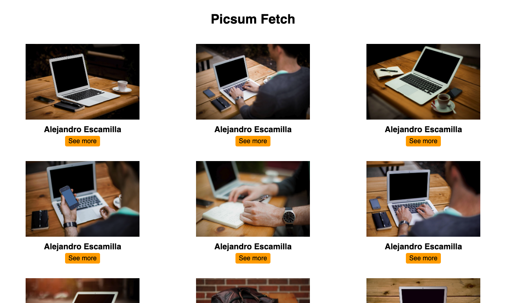

# Project Picsum Fetch

- This project was created as part of a coding bootcamp.
- the learning objective of this project: learning how to use fetch and APIs
- For this project, we should use Picsum's API to create a gallery via JavaScript.
- Clicking on the button opens a new window
- I have built error handling into my fetch

## Demo

https://cecilestaller.github.io/js-project-fetch-picsumAPI/

## Screenshots

## Tech Stack

- HTML5
- SCSS
- JavaScript
- RESTFUL API

## Link to used API

https://picsum.photos/v2/list

## Author

- [@cecilestaller](https://github.com/cecilestaller)
